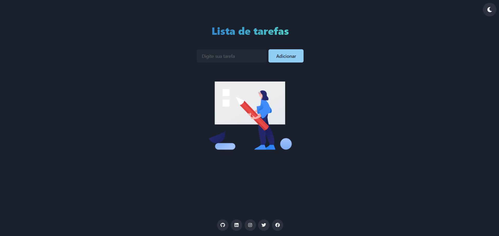

# React todo list
Um aplicativo de lista de tarefas simples desenvolvido com React, Chakra UI, React icons

##### [Live Demo](https://tasks.fabra.dev) on Vercel

<p align="center">
  <a src="https://tasks.fabra.dev" target="_blank"></a>
</p>

## 🚀 Getting Started

+ Clone este repositório 
```jsx
git clone https://github.com/raminhuk/react-todo-lis.git
```
+ Entre na pasta react-todo-list
```jsx
cd react-todo-list
```
+ Execute npm install para instalar as dependências 
```jsx
npm install
```
+ Execute npm start para rodar o projeto em http://localhost:3000/
```jsx
npm start
```
